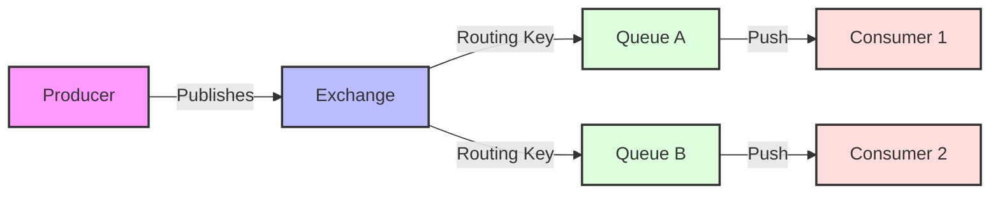
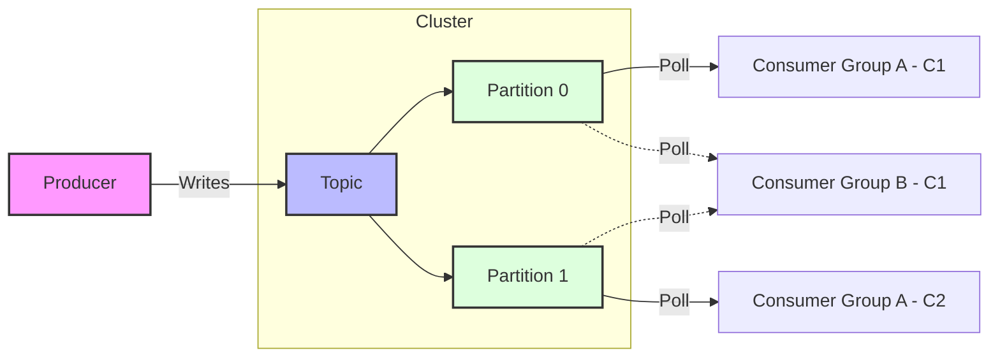

# Messaging Lab

This project demonstrates messaging patterns and integrations using Java Spring Boot, RabbitMQ, and Apache Kafka. It serves as a laboratory for exploring different messaging protocols, integration designs, and consumption strategies.

## Messaging & Java Spring Boot

Spring Boot provides robust support for building message-driven applications through projects like **Spring AMQP** and **Spring for Apache Kafka**.

### Protocols
*   **AMQP (Advanced Message Queuing Protocol)**: Used by RabbitMQ. It is a standardized protocol for message-oriented middleware.
*   **Kafka Protocol**: A binary TCP protocol optimized for high throughput and low latency, used by Apache Kafka.

### Integration Designs
*   **Producer-Consumer**: A basic pattern where a producer sends a message to a queue/topic, and a consumer processes it.
*   **Publish-Subscribe (Pub-Sub)**: A message is broadcast to multiple consumers.
    *   In RabbitMQ, this is achieved using Fanout Exchanges.
    *   In Kafka, this is the default behavior where multiple consumer groups subscribe to the same topic.

### Consumption Strategies
*   **Push**: The broker pushes messages to the consumer. RabbitMQ typically uses this model (via `MessageListener`).
*   **Poll**: The consumer actively requests messages from the broker. Kafka consumers poll the brokers for records.

### Spring Boot Integration
Spring Boot abstracts much of the boilerplate code:
*   **`RabbitTemplate` / `KafkaTemplate`**: High-level abstractions for sending messages.
*   **`@RabbitListener` / `@KafkaListener`**: Annotations to mark methods as message listeners.

---

## RabbitMQ

RabbitMQ is a widely deployed open-source message broker. It is lightweight and easy to deploy on premises and in the cloud.

### Key Concepts
*   **Producer**: Sends messages.
*   **Exchange**: Receives messages from producers and pushes them to queues based on rules.
*   **Queue**: A buffer that stores messages.
*   **Consumer**: Receives messages from the queue.

### Workflow Diagram

---

## Apache Kafka

Apache Kafka is a distributed event streaming platform capable of handling trillions of events a day. It is designed for high throughput and fault tolerance.

### Key Concepts
*   **Topic**: A category or feed name to which records are stored.
*   **Partition**: Topics are split into partitions for scalability.
*   **Broker**: A Kafka server.
*   **Consumer Group**: A group of consumers acting as a single logical subscriber.

### Workflow Diagram

---

## Comparison Summary

| Feature | RabbitMQ | Kafka |
| :--- | :--- | :--- |
| **Model** | Smart Broker, Dumb Consumer | Dumb Broker, Smart Consumer |
| **Delivery** | Push-based | Poll-based |
| **Persistence** | Queue-based (transient/durable) | Log-based (durable, retention policy) |
| **Use Case** | Complex routing, task queues | Event streaming, log aggregation, high throughput |
