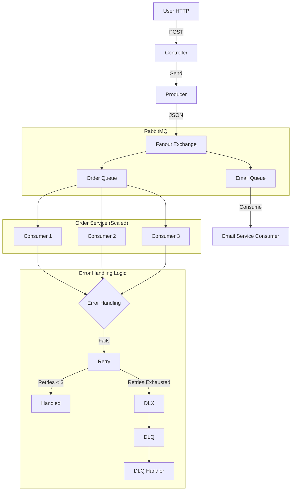
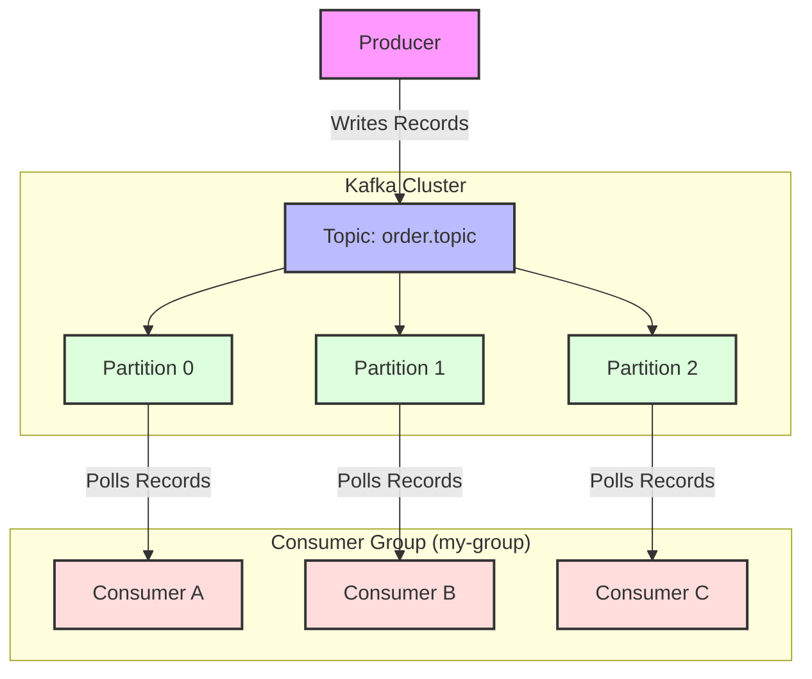
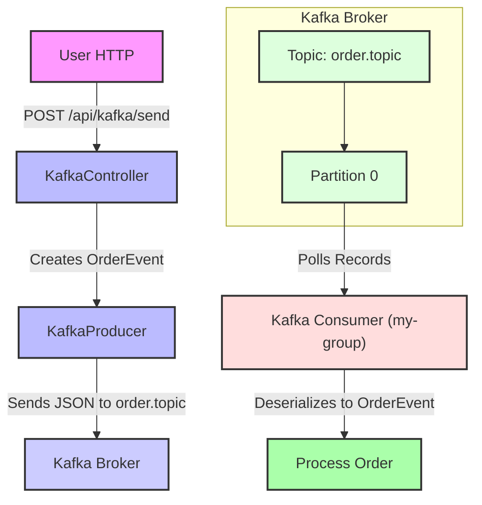

# Project Journey: From Zero to Resilient Messaging

**Date:** March 2026
**Scope:** Phase 1 (Basics), Phase 2 (Reliability), Phase 3 (Patterns), Phase 4 (Kafka Introduction)

---

## 🏗️ Phase 1: The Foundation (RabbitMQ)
**Goal:** Get two parts of an application to talk to each other asynchronously using RabbitMQ.
*(Details: Multi-module setup, Core Point-to-Point flow, JSON serialization)*

---

## 🛡️ Phase 2: Reliability & Resilience (RabbitMQ)
**Goal:** Ensure the system survives bad data and application crashes.
*(Details: Handled "Poison Pill" with DLQ, Handled "Transient Blips" with Spring Retry)*

---

## 📡 Phase 3: Messaging Patterns (RabbitMQ)
**Goal:** Move beyond simple 1-to-1 messaging.

### 1. The Pub/Sub Pattern (Fanout Exchange)
*   **Solution:** We used a `FanoutExchange` to broadcast a single message to both an `order.queue` and an `email.queue`.

### 2. The Competing Consumers Pattern (Scaling)
*   **Solution:** We scaled the Order Service by having multiple consumers work on the same queue using `concurrency="3"` on the `@RabbitListener`.

---

## 🧩 RabbitMQ Architecture Diagram (Scaling)

---

## 🪵 Phase 4: Introduction to Kafka (The "Log" Model)
**Goal:** Understand the paradigm shift from "Queue" to "Log" and implement basic Kafka messaging.

### 1. Kafka vs. RabbitMQ: A Paradigm Shift

| Feature         | RabbitMQ (Queue Model)                               | Kafka (Log Model)                                          |
| :-------------- | :--------------------------------------------------- | :--------------------------------------------------------- |
| **Core Concept**| Smart Broker, Dumb Consumer                          | Dumb Broker (Log), Smart Consumer                          |
| **Message Life**| Consumed messages are removed from the queue         | Messages are retained in the log for a configurable period   |
| **Delivery**    | Push-based (Broker pushes to Consumer)               | Pull-based (Consumer polls from Broker)                    |
| **Ordering**    | Guaranteed per queue                                 | Guaranteed per partition                                   |
| **Scaling**     | Competing Consumers on same queue                    | Consumer Groups, multiple consumers per partition          |
| **Use Case**    | Complex routing, task queues, traditional messaging  | Event streaming, log aggregation, high-throughput data pipelines |

### 2. Key Kafka Terminologies & Concepts

#### A. Topic
*   A category or feed name to which records are published. All records are organized into topics.
*   Similar to a table in a database, but append-only.

#### B. Partition
*   Topics are divided into ordered, immutable sequences of records called partitions.
*   Each record in a partition is assigned a sequential ID number called an **offset**.
*   Partitions allow a topic to be parallelized across multiple brokers and enable high throughput.

#### C. Offset
*   A unique identifier for each record within a partition. It's like an index or a bookmark.
*   Consumers track their own offset to know where they last read from.

#### D. Consumer Group
*   A set of consumers that cooperate to consume data from one or more topics.
*   Each partition is consumed by exactly one consumer instance within a consumer group. This enables parallel processing and load balancing.

#### E. Broker
*   A Kafka server. A Kafka cluster typically consists of multiple brokers.

### 3. Basic Kafka Producer & Consumer Implementation

We set up a new Spring Boot module (`lab-kafka`) to demonstrate basic Kafka messaging.

#### A. Project Setup
*   **`lab-kafka` Module:** Created a new Maven module.
*   **`pom.xml`:** Configured `org.springframework.kafka:spring-kafka` dependency. (Crucial fix: `groupId` was `org.springframework.kafka`, not `org.springframework.boot`).
*   **`application.yml`:** Configured `bootstrap-servers`, `topic` name, and serializers/deserializers.

#### B. Producer (`KafkaProducer.java` & `KafkaController.java`)
*   **`KafkaProducer`:** Uses `KafkaTemplate` to send `OrderEvent` objects to the `order.topic`.
*   **`KafkaController`:** Provides a REST endpoint (`POST /api/kafka/send`) to trigger the producer.
*   **Serialization:** `spring.kafka.producer.value-serializer: org.springframework.kafka.support.serializer.JsonSerializer` converts `OrderEvent` to JSON.

#### C. Consumer (`KafkaConsumer.java`)
*   **`@KafkaListener`:** Annotates a method to listen for messages from a specific topic and consumer group.
*   **Deserialization:** `spring.kafka.consumer.value-deserializer: org.springframework.kafka.support.serializer.JsonDeserializer` and `spring.json.value.default.type: org.adi.dto.OrderEvent` convert JSON back to `OrderEvent`.

### 4. Kafka Architecture Diagram

### 5. End-to-End Kafka Flow Diagram

