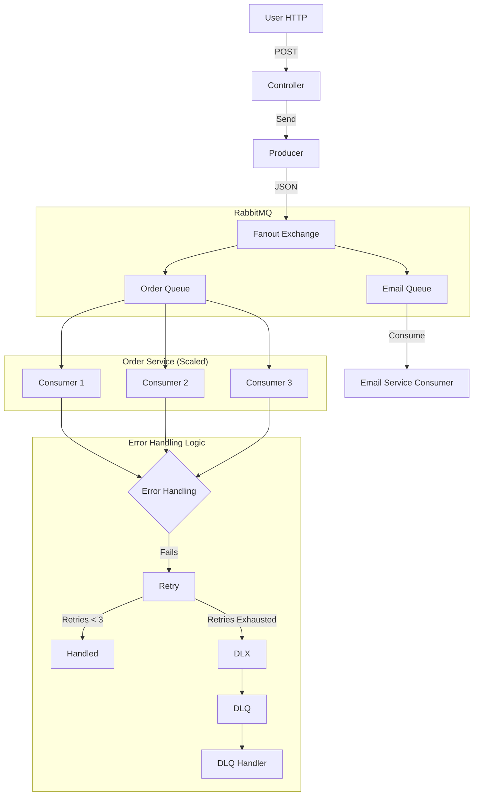

# Project Journey: From Zero to Resilient Messaging

**Date:** March 2026
**Scope:** Phase 1 (Basics), Phase 2 (Reliability), Phase 3 (Patterns)

---

## 🏗️ Phase 1: The Foundation
**Goal:** Get two parts of an application to talk to each other asynchronously using RabbitMQ.
*(Details: Multi-module setup, Core Point-to-Point flow, JSON serialization)*

---

## 🛡️ Phase 2: Reliability & Resilience
**Goal:** Ensure the system survives bad data and application crashes.
*(Details: Handled "Poison Pill" with DLQ, Handled "Transient Blips" with Spring Retry)*

---

## 📡 Phase 3: Messaging Patterns
**Goal:** Move beyond simple 1-to-1 messaging.

### 1. The Pub/Sub Pattern (Fanout Exchange)
We needed one event ("Order Placed") to trigger multiple independent actions (Process Order + Send Email).
*   **Solution:** We used a `FanoutExchange` to broadcast a single message to both an `order.queue` and an `email.queue`.

### 2. The Competing Consumers Pattern (Scaling)
We needed to handle high message load for the Order Service. A single consumer couldn't keep up.

#### A. The Problem
When message volume is high, a single consumer thread processing messages one-by-one becomes a bottleneck, leading to delays.

#### B. The Solution: Parallel Consumers
We scaled the Order Service by having multiple consumers work on the same queue.
*   **How it works:** RabbitMQ automatically distributes messages from a single queue among all connected consumers in a round-robin fashion.
*   **Implementation:** We added the `concurrency="3"` property to the `@RabbitListener` annotation for the Order Service. This tells Spring to create 3 consumer threads, all listening to `order.queue`.
*   **Result:** The application can now process up to 3 orders from the queue in parallel, dramatically increasing throughput.

---

## 🧩 Current Architecture Diagram (Scaling)

