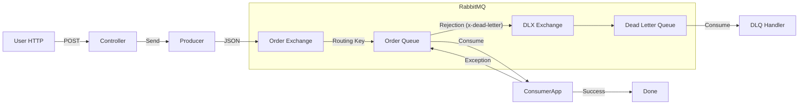

# Project Journey: From Zero to Resilient Messaging

**Date:** March 2026
**Scope:** Phase 1 (Basics) & Phase 2 (Reliability)

---

## 🏗️ Phase 1: The Foundation
**Goal:** Get two parts of an application to talk to each other asynchronously using RabbitMQ.

### 1. Project Structure (Multi-Module)
We avoided the common mistake of putting everything in one bucket.
*   **`lab-common`**: Contains shared data models (`OrderEvent`). This ensures the Producer and Consumer speak the same language.
*   **`lab-rabbitmq`**: The Spring Boot application containing both the Producer and Consumer logic.
*   **`compose.yml`**: Infrastructure as Code. We spun up RabbitMQ (with Management UI) and Kafka using Docker, ensuring a clean environment.

### 2. The Core Messaging Flow
We implemented a **Point-to-Point** pattern:
1.  **Trigger:** User hits `POST /api/rabbit/send`.
2.  **Producer:** `RabbitProducer` takes the data, wraps it in an `OrderEvent`, and sends it to the Exchange.
3.  **Router:** The `TopicExchange` uses a Routing Key (`order.routing.key`) to deliver the message to the correct Queue (`order.queue`).
4.  **Consumer:** `RabbitConsumer` listens to the queue and processes the message.

### 3. Serialization (JSON vs. Java)
*   **Initial thought:** Use `Serializable` (Java Native Serialization).
*   **Decision:** We removed `Serializable` and switched to **JSON** using `Jackson2JsonMessageConverter`.
*   **Why?** JSON is language-agnostic, readable, and safer than Java deserialization.

---

## 🛡️ Phase 2: Reliability & Resilience
**Goal:** Ensure the system survives bad data and application crashes.

### 1. The "Poison Pill" Problem
We simulated a scenario where a message causes the consumer to crash (throw an exception).
*   **Observation:** By default, Spring AMQP puts the failed message back at the front of the queue (`requeue=true`).
*   **Result:** The app entered an **Infinite Retry Loop**, processing the same crashing message thousands of times per second.

### 2. The Solution: Dead Letter Queue (DLQ)
We architected a safety net to catch failed messages.

#### A. Infrastructure Changes (`RabbitConfig.java`)
We redefined our main queue to include "instructions for failure":
```java
QueueBuilder.durable(queueName)
    .withArgument("x-dead-letter-exchange", dlxName)
    .withArgument("x-dead-letter-routing-key", dlqRoutingKey)
    .build();
```

#### B. Configuration Changes (`application.yml`)
We told Spring to stop the infinite loop:
```yaml
spring:
  rabbitmq:
    listener:
      simple:
        default-requeue-rejected: false # Reject -> Send to DLQ
```

#### C. Handling the Dead Letters
We added a second listener in `RabbitConsumer` specifically for the DLQ.
*   **Main Listener:** Processes orders. If it fails -> throws exception.
*   **DLQ Listener:** Receives the failed order, logs it, and safely removes it from the flow.

---

## 🧩 Current Architecture Diagram

